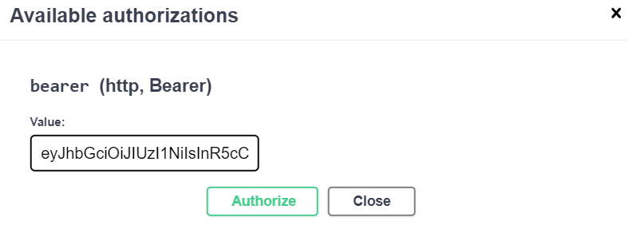

# Jobs-RESTful-API

This is a Restful API created with express.js.

Here, a recruiter who wants to hire candidates for his/her company can use this API.
Here, in this API, the recruiter first needs to register for an account and after the user creates an account, he/she will receive a email in his/her email inbox regarding her registration. Then, the recruiter can create as many job openings as possible and all the job openings created by the recruiter will be stored in his/her account.

The recruiter also has the option of editing a particular job posting as well as deleting a particular job.

All the data will be stored inside the MongoDB database.

This Restful API is also protected from different malicious activities with the help of packages like helmet.js and xss-clean.

This API also has the feature of restricting users from making too many repeated requests continuously to API endpoints with the help of express-rate-limit.


## How to authenticate in Swagger Documentation

After successful signup/login, you need to authorize yourself manually in swagger docs because if you don't authorize yourself manually, then, you will get this error when you will try to perform any jobs related task: 
```
{
  "errorMsg": "Authentication Error | No headers found"
}
```

Now, there are 3 steps to authorize yourself in swagger docs:

### Step 1

After you successfully register/login, you will receive a token.


You need to first copy the token

### Step 2

After you have copied the token, you need to click on the "Authorize" option present at the top of the documentation.


### Step 3

After you click on the "Authorize", you will for value. In the value's input field, just paste the token and click on "Authorize"



<br />

Now, you are fully authorized. You can now close the modal of 'Authorize' and perform any jobs related task and all those task will be stored inside your account.